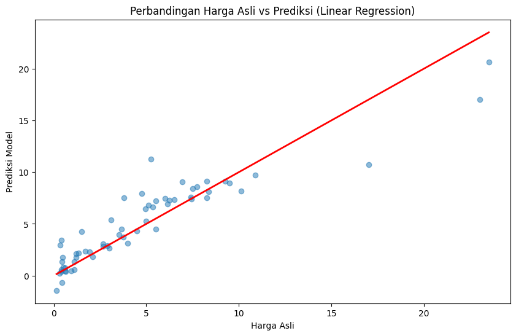

# 🚗 Car Price Prediction using Linear Regression

## 📌 Project Overview
Project ini bertujuan untuk memprediksi harga jual mobil bekas berdasarkan berbagai fitur seperti tahun, harga dealer, kilometer yang ditempuh, dan jenis transmisi menggunakan algoritma **Linear Regression**.

## 📊 Dataset
Dataset diambil dari Kaggle: **Vehicle Dataset from CarDekho**.
- **Features:** Present_Price, Kms_Driven, Fuel_Type, Seller_Type, Transmission, Owner, Age.
- **Target:** Selling_Price.

🛠️ Installation
Clone repository:
```bash
git clone https://github.com/egiyudasebayang-collab/ML-Linear-Regression-car-price-prediction.git
```

Masuk ke folder:
```bash
cd ML-Linear-Regression-car-price-prediction
```

Install library:
```bash
pip install -r requirements.txt
```

## 📈 Results
...

